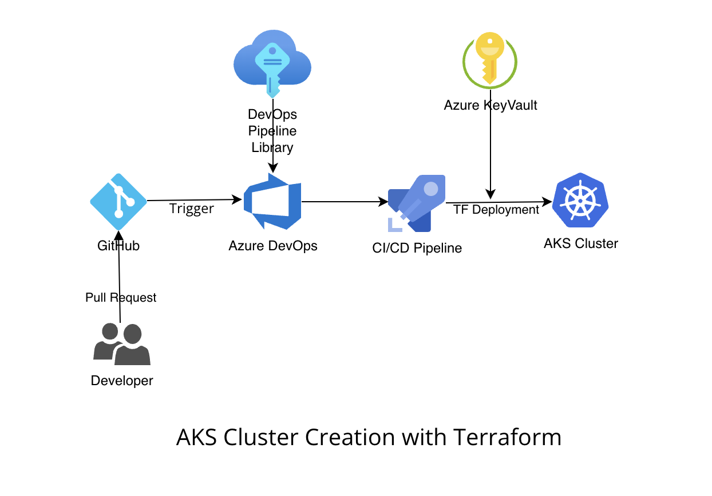

# AKS Deployment with Terraform

# Table of Contents 
- [Introduction](#Introduction)
- [Architecture](#Architecture)
- [Solution Overview](#Solution-Overview)

# Introduction

The goal of this project is to create a an Azure Kubernetes Services Cluster with Terraform and using Azure DevOps pipeline. 

# Architecture

#### **Architecture Diagram**

# Solution overview

This repository contains Terraform code to deploy an AKS Cluster including default network and Log analytics for the Cluster. It uses Azure DevOps to use GitHub code and deploy those to create Azure Infrastructure.

